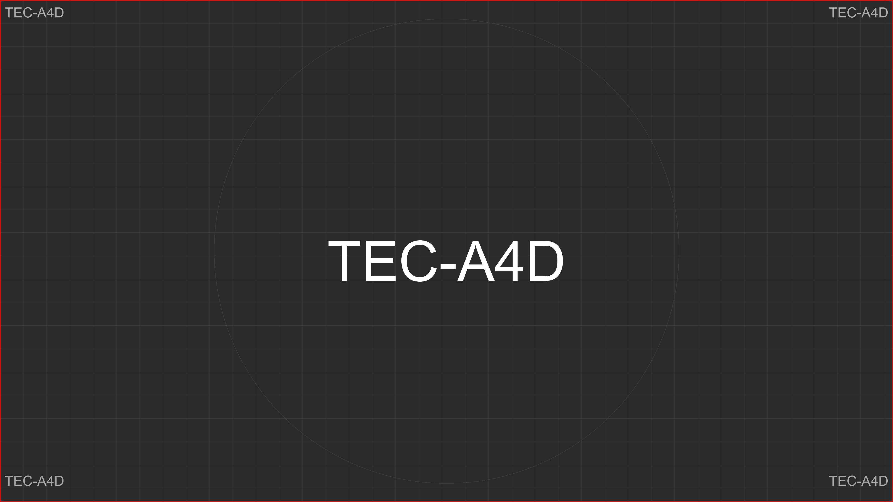

# Spy 👀

**Instantly identify your Windows PC with a custom hostname wallpaper.**

Perfect for multi-machine setups, labs, or remote desktop environments.



## Quick Start

**Download:** [Latest Release](https://github.com/theexperiential/spy/releases)

Just run `spy.exe` - that's it! Your desktop wallpaper updates with your hostname.

## Features

- 🖥️ **Large hostname text** - visible at a glance
- 📍 **Corner labels** - visible even with windows open
- 🌐 **IP address display** - optional, shown at top center
- 📐 **Grid & circle overlay** - for pixel mapping/calibration
- 🎨 **3 modes** - Quick, Quick+IP, or full customization
- 🔍 **4K/HiDPI aware** - detects true screen resolution
- ⚡ **Auto-scaling** - long hostnames never get cropped

## Usage

### Three Modes

**[1] Quick (Default)**
- Press Enter
- No IP address
- Default settings

**[2] Quick + IP**
- Shows IP address at top
- Auto-detects network adapter
- Default settings

**[3] Advanced**
- Full customization
- Optional IP address


**Advanced Mode Options:**
- Background, grid, border, text colors
- Toggle features on/off
- Adjust sizes and spacing

## Build From Source

```bash
pip install -r requirements.txt
python spy.py
```

**Create executable:**
```bash
build.bat
```

## Deployment

For IT admins deploying to multiple machines:

```powershell
# Copy spy.exe to machines
\\server\share\spy.exe

# Or via logon script, Group Policy, etc.
```

## Default Settings

- Background: Dark gray
- Grid: 100px spacing
- Circle: Full screen height (perfect circle)
- Border: 3px red
- Center text: Auto-sized (1080p=120pt, 1440p=160pt, 4K=240pt)
- Corner text: Auto-sized (1080p=30pt, 1440p=40pt, 4K=60pt)

## License

MIT - Free to use and modify.
